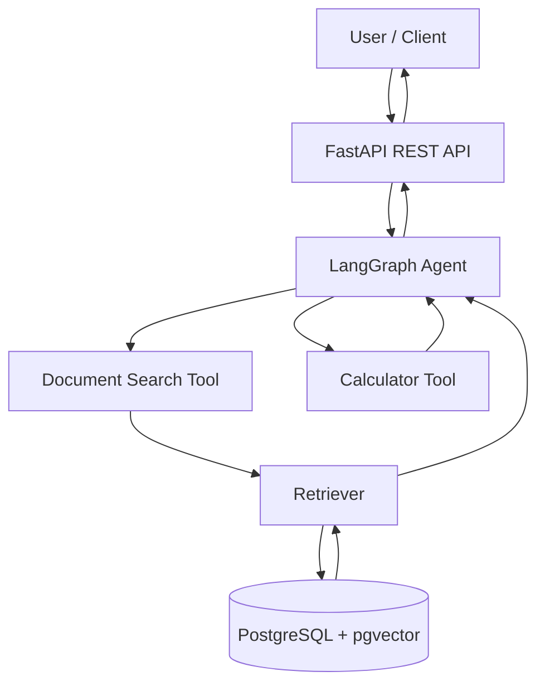
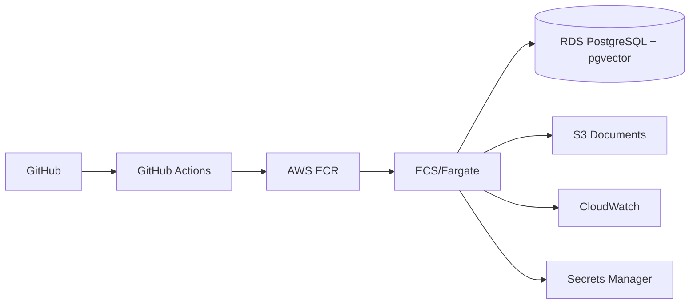

# Enterprise Knowledge Agent

An end-to-end agentic RAG application for querying and analysing technical documents, built with LangGraph, FastAPI, PostgreSQL/pgvector, Docker and AWS.

It demonstrates:

- FastAPI REST APIs
- RAG over technical documents
- PostgreSQL + pgvector
- LangGraph workflow
- tool calling
- deterministic local mock mode
- Docker / Docker Compose
- structured logging
- Pytest
- evaluation harness
- GitHub Actions CI
- AWS deployment path: ECR + ECS/Fargate + RDS + S3 + CloudWatch + Secrets Manager

## Business scenario

An engineering company has product manuals, troubleshooting guides, technical specifications and operating procedures. Engineers need to ask questions such as:

- What is the maximum operating temperature of Product A?
- What happens if the primary cooling pump fails?
- Which document mentions low-pressure warnings?
- Compare the specifications of Product A and Product B.

The application ingests technical documents, retrieves relevant evidence, and returns grounded answers with source references.

## Architecture



Cloud target:



## Production-like parts

- package-based Python structure
- environment-based configuration
- REST API boundary
- persistent vector database
- containerisation
- health endpoint
- structured JSON logs
- automated tests
- evaluation dataset
- CI workflow
- explicit separation between API, RAG, agent and infrastructure
- no secrets committed to the repository
- cloud deployment architecture

## Simplifications

This is a portfolio project, not a customer production system. The current version intentionally omits:

- authentication and SSO
- multi-tenant access control
- WAF / rate limiting
- Terraform
- distributed tracing
- enterprise governance and privacy controls
- load testing
- asynchronous ingestion workers

Mock mode also uses deterministic educational embeddings instead of a production semantic model.

## Repository structure

```text
enterprise-knowledge-agent/
├── app/
│   ├── api/
│   ├── agent/
│   ├── core/
│   ├── db/
│   ├── providers/
│   ├── rag/
│   ├── schemas/
│   └── main.py
├── sample_docs/
├── evaluation/
├── tests/
├── deployment/
├── .github/workflows/
├── Dockerfile
├── docker-compose.yml
├── requirements.txt
├── .env.example
└── README.md
```

## Quick start — mock mode

Requirements:

- Docker Desktop
- Docker Compose

Start:

```bash
cp .env.example .env
docker compose up --build
```

Open Swagger UI:

```text
http://localhost:8000/docs
```

Health check:

```bash
curl http://localhost:8000/health
```

Expected:

```json
{"status":"ok","mode":"mock"}
```

## Upload a document

```bash
curl -X POST \
  -F "file=@sample_docs/cooling_system_manual.txt" \
  http://localhost:8000/documents
```

Then query:

```bash
curl -X POST \
  -H "Content-Type: application/json" \
  -d '{"question":"What happens if Pump A fails?"}' \
  http://localhost:8000/query
```

## Real LLM mode

Change `.env`:

```env
APP_MODE=openai
OPENAI_API_KEY=your_key
OPENAI_CHAT_MODEL=gpt-4.1-mini
OPENAI_EMBEDDING_MODEL=text-embedding-3-small
EMBEDDING_DIM=1536
```

Because vector dimensionality changes, recreate the local DB volume:

```bash
docker compose down -v
docker compose up --build
```

## API endpoints

- `GET /health`
- `GET /documents`
- `POST /documents`
- `POST /query`

## Learning path

### 1. RAG
Read:

- `app/rag/chunking.py`
- `app/providers/embeddings.py`
- `app/rag/ingest.py`
- `app/rag/retrieval.py`

Learn chunking, embeddings, vector similarity, metadata and citations.

### 2. API engineering
Read:

- `app/schemas/api.py`
- `app/api/routes.py`
- `app/main.py`

Learn request validation, HTTP boundaries, response schemas and separation of concerns.

### 3. Agent workflow
Read:

- `app/agent/tools.py`
- `app/agent/graph.py`

Learn LangGraph state, nodes, edges and tool boundaries.

### 4. Docker
Read `Dockerfile` and `docker-compose.yml`.

Learn image vs container, service networking, environment variables and volumes.

### 5. Evaluation
Run:

```bash
python -m evaluation.evaluate
```

The evaluation reports retrieval Recall@4, source accuracy and a simple grounding check.

Never invent evaluation numbers in a CV. Only report metrics you actually produce.

### 6. CI
Read `.github/workflows/ci.yml`.

Understand why tests and Docker-build validation run automatically on pushes and pull requests.

### 7. AWS
Read `deployment/aws.md` and the example ECS task definition.

Learn ECR, ECS/Fargate, RDS, S3, IAM, Secrets Manager and CloudWatch.

## Important design decisions

### Why PostgreSQL + pgvector rather than FAISS?

This project is aimed at application engineering rather than notebook experimentation. PostgreSQL provides persistent storage, metadata and vector retrieval in a datastore that can be operated as part of a service architecture.

### Why FastAPI?

It turns the AI capability into a service that other applications can integrate with rather than leaving the model inside a local Python script.

### Why LangGraph?

The target roles increasingly ask for explicit agent orchestration and tool-based workflows. LangGraph makes workflow state and execution visible and controllable.

### Why ECS/Fargate before Kubernetes?

It demonstrates containerised cloud deployment without adding unnecessary Kubernetes complexity at the beginning of your learning path.

### Why mock mode?

A public portfolio repository should be runnable without giving reviewers your API credentials. Deterministic mode also makes tests repeatable.

## Security considerations

This repo demonstrates basic good practice:

- `.env` is ignored
- `.env.example` contains no credentials
- cloud secrets should go in Secrets Manager
- IAM should use least privilege
- database credentials should not be hard-coded
- logs should not contain secrets

A real enterprise application would additionally need authentication, authorisation, auditability, encryption policies, access control, privacy/governance controls and security testing.

## AWS target

deploy:

```text
GitHub
  -> GitHub Actions
  -> ECR
  -> ECS/Fargate
  -> RDS PostgreSQL/pgvector
  -> S3
  -> CloudWatch
  -> Secrets Manager
```

**Enterprise Knowledge Agent — Personal Applied AI Engineering Project**

- Built an end-to-end agentic RAG application using LangGraph, FastAPI, PostgreSQL/pgvector and Docker.
- Implemented document ingestion, semantic retrieval, tool calling and source-grounded responses through REST APIs.
- Developed automated tests and an evaluation harness for retrieval quality and citation/source correctness.
- Implemented GitHub Actions CI for automated testing and container-build validation.
- Deployed the containerised service to AWS ECS/Fargate with ECR, RDS, S3, Secrets Manager and CloudWatch. **Use this bullet only after you actually do the deployment.**

## Questions you should be able to answer after completing the project

1. Why use pgvector rather than FAISS?
2. What happens during document ingestion?
3. What is an embedding?
4. How does cosine similarity retrieval work?
5. What is the difference between RAG and an agent workflow?
6. Why expose the application through FastAPI?
7. What problem does Docker solve?
8. Why ECS/Fargate rather than Lambda?
9. How would you manage secrets?
10. How would you diagnose a failing cloud request?
11. How do you evaluate retrieval quality?
12. What would you change for thousands of concurrent users?
13. How would you implement document-level permissions?
14. What hallucination risks remain?
15. Which parts are genuinely production-like and which are educational simplifications?

If you can explain these from your own implementation experience, the project is doing what a portfolio project should do: demonstrating engineering capability rather than merely listing technologies.
